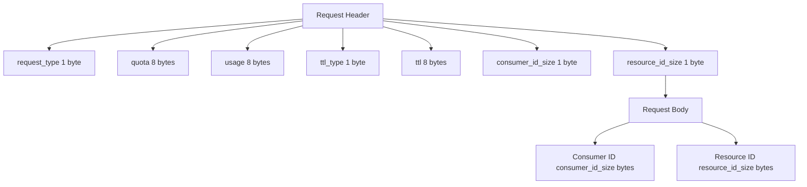

## Memory Layout Table

```
+---------------------+-----------------------------+
| Field               | Size (bytes)                |
+---------------------+-----------------------------+
| request_type        | 1                           |
| quota               | 8                           |
| usage               | 8                           |
| ttl_type            | 1                           |
| ttl                 | 8                           |
| consumer_id_size    | 1                           |
| resource_id_size    | 1                           |
| consumer_id         | consumer_id_size            |
| resource_id         | resource_id_size            |
+---------------------+-----------------------------+
```

## Memory Layout Binary Shape

```
Offset  Size (bytes)  Field
0x00    1             request_type
0x01    8             quota
0x09    8             usage
0x11    1             ttl_type
0x12    8             ttl
0x1A    1             consumer_id_size
0x1B    1             resource_id_size
0x1C    N             consumer_id (N = consumer_id_size)
0x1C+N  M             resource_id (M = resource_id_size)
```

## Memory Layout using Mermaid

