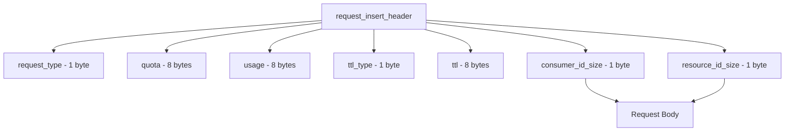
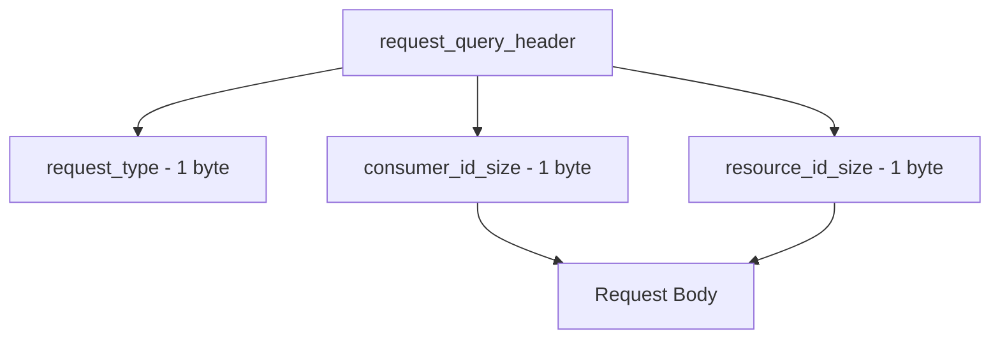
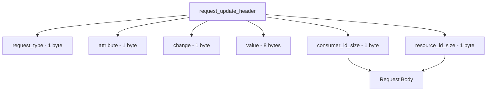
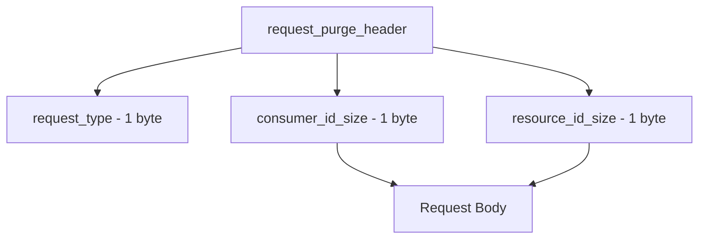
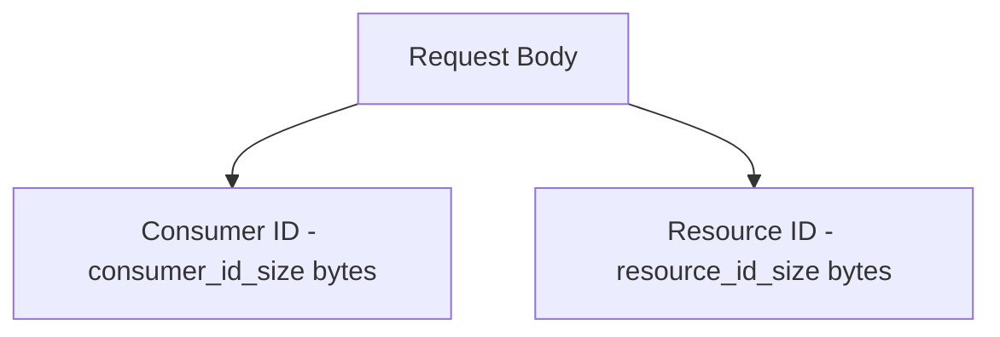

## Request Insert Header

```mermaid
flowchart TD
    A[request_insert_header]
    A --> A1[request_type - 1 byte]
    A --> A2[quota - 8 bytes]
    A --> A3[usage - 8 bytes]
    A --> A4[ttl_type - 1 byte]
    A --> A5[ttl - 8 bytes]
    A --> A6[consumer_id_size - 1 byte]
    A --> A7[resource_id_size - 1 byte]
    A6 --> B[Request Body]
    A7 --> B[Request Body]
```

## Request Query Header

```mermaid
flowchart TD
    B[request_query_header]
    B --> B1[request_type - 1 byte]
    B --> B2[consumer_id_size - 1 byte]
    B --> B3[resource_id_size - 1 byte]
    B2 --> C[Request Body]
    B3 --> C[Request Body]
```

## Request Update Header

```mermaid
flowchart TD
    C[request_update_header]
    C --> C1[request_type - 1 byte]
    C --> C2[attribute - 1 byte]
    C --> C3[change - 1 byte]
    C --> C4[value - 8 bytes]
    C --> C5[consumer_id_size - 1 byte]
    C --> C6[resource_id_size - 1 byte]
    C5 --> D[Request Body]
    C6 --> D[Request Body]
```

## Request Purge Header

```mermaid
flowchart TD
    B[request_purge_header]
    B --> B1[request_type - 1 byte]
    B --> B2[consumer_id_size - 1 byte]
    B --> B3[resource_id_size - 1 byte]
    B2 --> C[Request Body]
    B3 --> C[Request Body]
```

## Request Body

```mermaid
flowchart TD
    D[Request Body]
    D --> D1[Consumer ID - consumer_id_size bytes]
    D --> D2[Resource ID - resource_id_size bytes]
```